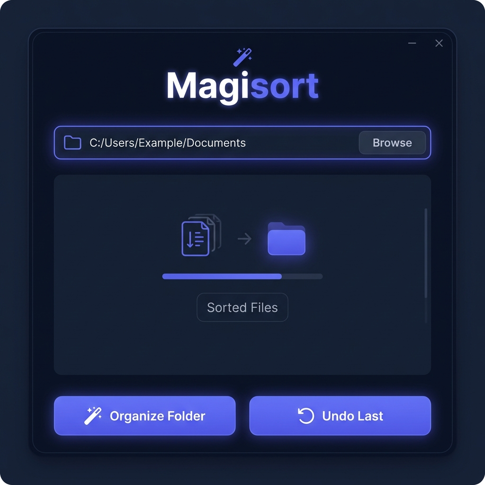

# Magisort | File Organizer



A powerful, native Python tool to organize your messy folders into categorized subfolders based on file types. It features both a modern Desktop UI and a fast Command Line Interface.

## 🚀 Features

- **Smart Categorization**: Groups files into logical folders (Images, Documents, Video, Audio, Scripts, Data, GIS, etc.).
- **Desktop App**: Sleek native UI using `CustomTkinter` with a built-in folder picker.
- **CLI Mode**: Run it directly from your terminal for quick sorting.
- **Undo Feature**: Quickly reverse the last organization session with a single command.
- **Auto-Subfolder Creation**: Automatically creates necessary folders if they don't exist.
- **Conflict Handling**: Appends counters (e.g., `file_1.png`) to avoid overwriting existing files.
- **Safe & Standard**: Uses Python's standard library for all file operations.

## 📦 Releases

You can download the latest standalone binary for Linux:

- **Magisort_v1.0_Linux.zip**: Standalone package. Includes **Magisort.bin** (no Python required).

## 📂 Supported Categories

- **Images**: `.jpg`, `.png`, `.gif`, `.webp`, `.svg`, `.ico`, `.tiff`
- **Documents**: `.pdf`, `.docx`, `.txt`, `.md`, `.xlsx`, `.pptx`, `.csv`, `.epub`
- **Audio/Video**: `.mp3`, `.wav`, `.ogg`, `.mp4`, `.mkv`, `.mov`, `.webm`
- **Code/Scripts**: `.py`, `.js`, `.ts`, `.cpp`, `.rs`, `.sh`, `.php`, `.sql`
- **GIS/Data**: `.kml`, `.kmz`, `.geojson`, `.json`, `.yaml`, `.xml`
- **System**: `.iso`, `.img`, `.exe`, `.deb`, `.log`
- ... and over 80+ other extensions.

## 🛠️ Installation

Ensure you have Python 3.x installed, then install the modern UI components:

```bash
pip install customtkinter
```

## 🖥️ Usage

### 1. Desktop Application (Recommended)

Launch the graphical interface to browse folders and organize visually:

```bash
python3 desktop_app.py
```

### 2. Command Line Interface

Organize a folder directly via terminal:

```bash
python3 organizer.py /path/to/folder
```

### 🔄 Undoing Changes

If you made a mistake, you can revert the organization in a specific folder:

**Via Desktop**: Click the "Undo Last" button.
**Via CLI**:

```bash
python3 organizer.py /path/to/folder --undo
```

## 🏗️ Building from Source

To create your own standalone executable (like the one in the Releases), use **PyInstaller**:

1. Install PyInstaller:

   ```bash
   pip install pyinstaller
   ```

2. Build the binary (Linux example):
   ```bash
   pyinstaller --noconsole --onefile --name "Magisort" --add-data "$(python3 -c 'import customtkinter; import os; print(os.path.dirname(customtkinter.__file__))'):customtkinter" desktop_app.py
   ```
   The binary will be generated in the `dist/` folder.

## 📜 Requirements

- Python 3.x
- `customtkinter` (for the Desktop UI)
